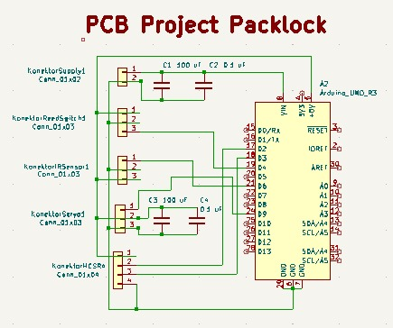
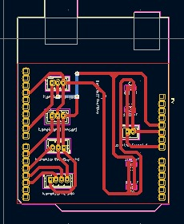
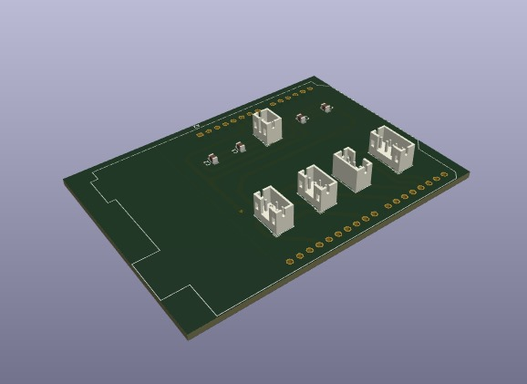

# Packlock
# Smart-Kotak-Paket-Berbasis-IoT

Proyek ini bertujuan untuk mengembangkan smart kotak paket berbasis IoT bernama PackLock, yang memungkinkan pengguna memantau status keberadaan paket secara real-time melalui dashboard web berbasis PHP. Sistem ini dirancang sebagai solusi pengiriman barang tanpa tatap muka yang aman dan efisien, terutama di era digital saat ini. PackLock dibangun menggunakan Arduino Uno sebagai mikrokontroler utama yang mengatur pembacaan sensor, kontrol aktuator, dan komunikasi data ke server lokal.

Untuk mendeteksi keberadaan paket, sistem menggunakan sensor infrared yang dipasang di dalam kotak. Selain itu, sensor ultrasonik dan reed switch digunakan untuk memantau status pintu depan dan pintu belakang kotak, apakah dalam keadaan tertutup atau terbuka. Ketika kondisi berubah, sistem akan mengirimkan data ke server melalui komunikasi serial dan hasilnya ditampilkan pada web secara real-time. Pengguna juga dapat menerima notifikasi dan melakukan kontrol jarak jauh melalui dashboard, termasuk membuka pintu kotak secara otomatis.

Web dashboard PackLock dibangun menggunakan PHP yang terhubung ke database untuk menyimpan dan menampilkan status terkini dari kotak paket. Dengan antarmuka yang sederhana, pengguna dapat dengan mudah mengetahui apakah terdapat paket di dalam kotak dan apakah pintu dalam keadaan tertutup atau terbuka. Sistem ini diharapkan dapat meningkatkan keamanan dan efisiensi dalam proses pengiriman dan pengambilan paket di lingkungan rumah atau perkantoran cerdas (smart building).

# Team Member :
|      NRP      |            Nama             |         Jobdesk          |
| :-----------: | :-------------------------: | :----------------------: |
| 2123500023    | Muhammad Fariz Ibnu T.H     | Hardware Developer       | 
| 2123500011    | M . Ghozali                 | Mekanik                  | 
| 2123500013    | Gede Satya Prawira Negara   | Programmer               | 
| 2123500008    | M . Ragita Dwi Yuliansyah   | Mekanik                  | 
| 2123500012    | Setyo Budi Utomo            | Mekanik                  | 
| 2123500021    | Adam Surya Waskito          | UI/UX Designer           |

## Support By :
>- Dosen Pengampu : Akhmad Hendriawan ST., MT. (NIP.197501272002121003)
>- Mata kuliah : Workshop Mikrokontroller
>- Program Studi : D3 Teknik Elektronika
>- Politeknik Elektronika Negeri Surabaya 

# Komponen Utama 
| Komponen |             Fungsi                | 
|----------|-----------------------------------|                       
|Arduino Uno| pengontrol sistem |
| Ultrasonic Sensor HC-SR04  | deteksi pintu depan tertutup atau tidak |               
|Sensor Infrared (IR) Proximity FC-51 |deteksi paket masuk|
|Reed Switch + Magnet | deteksi pintu belakang terbuka/tertutup)|
|Servo Motor (SG90 / MG90S)|untuk membuka pintu|

# Alat & Bahan
- Balok kayu Diameter 2 CM (5 Buah)
- Karton
- Palu
- Paku Kecil
- Meteran
- Lem kayu
- Cat Kayu
- Gergaji
- Penggaris
- bulpoint

# Langkah-Langkah Pengerjaan
1. Ukur kayu menggunakan meteran dan beri tanda menggunakan bulpoint agar mudah untuk proses pemotongan.
2. Potong kayu menggunakan gergaji dengan panjang tinggi 1 Meter (4 Buah), panjang Lebar 46 CM (12 Buah).
   
3. Ratakan disetiap ujung yang sudah dipotong biar terlihat rapih kemudian sambung menggunakan paku menjadi bentuk balok.
   
4. Jika kayu sudah terpasang menjadi satu maka dilakukan pengecatan.
   
5. Potong Karton menggunakan cutter dan dibantu dengan penggaris sebagai alat ukur sesuaikan dengan ukuran misalnya untuk bagian bawah dan atas 50 cm X 50 cm.
   
6. Tempelkan karton pada kayu menggunakan lem kayu dan beri paku agar bisa merekat dengan sempurna.
7. Potong karton jika terdapat sisa yang berlebihan agar terlihat rapih.

## [Hardware](https://github.com/InnoBox4/Packlock-Smart-Kotak-Paket-Berbais-IoT/tree/main/HARDWARE)

Berikut ini adalah hasil skematik dari rangkaian Smart Kotak Paket Berbasis IoT menggunakan software KiCad.

Berikut ini adalah hasil layout dari rangkaian Smart Kotak Paket Berbasis IoT menggunakan software KiCad.

Berikut ini adalah hasil 3D dari rangkaian Smart Kotak Paket Berbasis IoT menggunakan software KiCad.

## [Desain 3D](https://github.com/InnoBox4/Packlock-Smart-Kotak-Paket-Berbais-IoT/tree/main/DESIGN)

Berikut ini adalah Desain 3D Packlock Bagian Dalam.

Berikut ini adalah Desain 3D Packlock Tampak Depan.

## [UI/UX](https://github.com/InnoBox4/Packlock-Smart-Kotak-Paket-Berbais-IoT/tree/main/UI)

Berikut ini adalah UI/UX Web Packlock.

## Diagram Block

