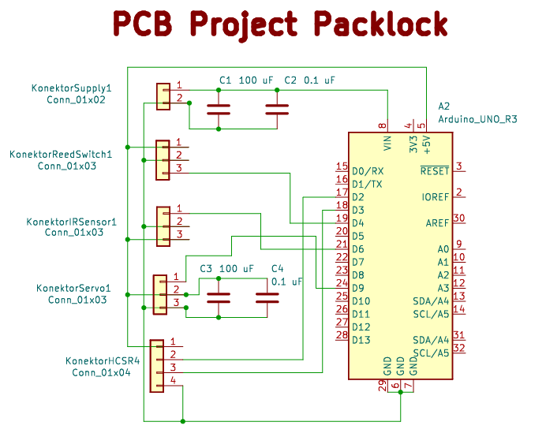
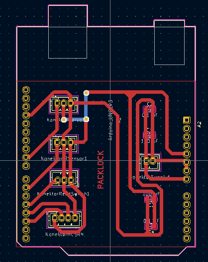
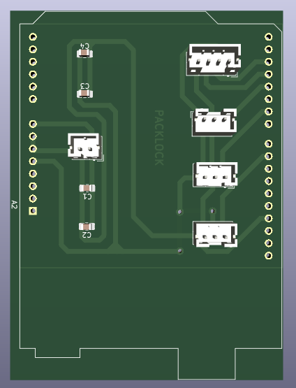
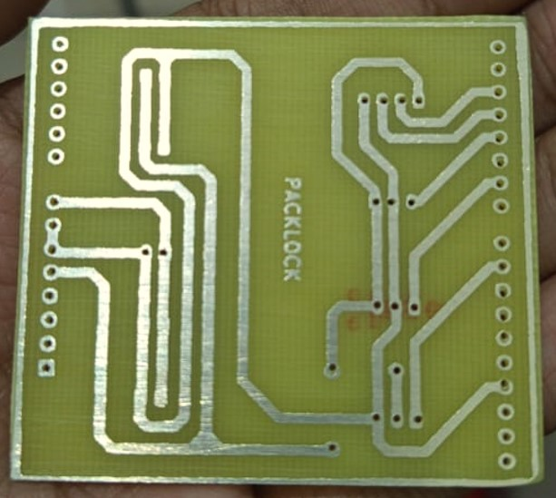
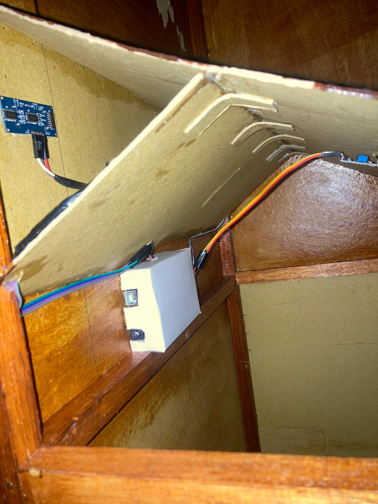

# Packlock
## Smart-Kotak-Paket-Berbasis-IoT

Proyek ini bertujuan untuk mengembangkan smart kotak paket berbasis IoT bernama PackLock, yang memungkinkan pengguna memantau status keberadaan paket secara real-time melalui dashboard web berbasis PHP. Sistem ini dirancang sebagai solusi pengiriman barang tanpa tatap muka yang aman dan efisien, terutama di era digital saat ini. PackLock dibangun menggunakan Arduino Uno sebagai mikrokontroler utama yang mengatur pembacaan sensor, kontrol aktuator, dan komunikasi data ke server lokal.

Untuk mendeteksi keberadaan paket, sistem menggunakan sensor infrared yang dipasang di dalam kotak. Selain itu, sensor ultrasonik dan reed switch digunakan untuk memantau status pintu depan dan pintu belakang kotak, apakah dalam keadaan tertutup atau terbuka. Ketika kondisi berubah, sistem akan mengirimkan data ke server melalui komunikasi serial dan hasilnya ditampilkan pada web secara real-time. Pengguna juga dapat menerima notifikasi dan melakukan kontrol jarak jauh melalui dashboard, termasuk membuka pintu kotak secara otomatis.

Web dashboard PackLock dibangun menggunakan PHP yang terhubung ke database untuk menyimpan dan menampilkan status terkini dari kotak paket. Dengan antarmuka yang sederhana, pengguna dapat dengan mudah mengetahui apakah terdapat paket di dalam kotak dan apakah pintu dalam keadaan tertutup atau terbuka. Sistem ini diharapkan dapat meningkatkan keamanan dan efisiensi dalam proses pengiriman dan pengambilan paket di lingkungan rumah atau perkantoran cerdas (smart building).

## Support By :
>- Dosen Pengampu : Akhmad Hendriawan ST., MT. (NIP.197501272002121003)
>- Mata kuliah : Workshop Mikrokontroller
>- Program Studi : D3 Teknik Elektronika
>- Politeknik Elektronika Negeri Surabaya 

## Team Member :
|      NRP      |            Nama             |         Jobdesk          |
| :-----------: | :-------------------------: | :----------------------: |
| 2123500023    | Muhammad Fariz Ibnu T.H     | Hardware Developer       | 
| 2123500011    | M . Ghozali                 | Mekanik                  | 
| 2123500013    | Gede Satya Prawira Negara   | Programer               | 
| 2123500008    | M . Ragita Dwi Yuliansyah   | Project Manager (PM)                  | 
| 2123500012    | Setyo Budi Utomo            | Mekanik                  | 
| 2123500021    | Adam Surya Waskito          | UI/UX Designer           |

## Komponen Utama 
| Komponen |             Fungsi                | 
|----------|-----------------------------------|                       
|Arduino Uno| pengontrol sistem |
| Ultrasonic Sensor HC-SR04  | deteksi pintu depan tertutup atau tidak |               
|Sensor Infrared (IR) Proximity FC-51 |deteksi paket masuk|
|Reed Switch + Magnet | deteksi pintu belakang terbuka/tertutup)|
|Servo Motor (SG90 / MG90S)|untuk membuka pintu|

## Daftar Isi
- [Komponen Yang Digunakan](#Komponen-Yang-Digunakan)
- [Blok Diagram](#Blok-Diagram)
- [Diagram Arsitektur Sistem](#Diagram-Arsitektur-Sistem)
- [Hardware](#Hardware)
- [Desain UI UX](#Desain-UI-UX)
- [Desain 3D](#Desain-3D)
- [Desain Yang Sudah Jadi](#Desain-Yang-Sudah-Jadi)

## Komponen Yang Digunakan
1.Hardware
- Arduino Uno
- Motor Servo
- Sensor IR Obstacle
- Sensor Ultrasonik
- Conector Molex
- Shield PCB
- Kabel Jumper
  

2.Software
- Arduino IDE
- Visual Studio Code
- Kicad
- Inventor
- Figma
- Wokwi

3.Alat 
- Palu
- Meteran
- Gergaji
- Penggaris
- bulpoint
- Cutter
- Gunting
- Kuas
- Obeng
- Lem Tembak
- Solder 
  
4.Bahan
- Balok kayu Diameter 2 CM (5 Buah)
- Karton
- Paku Kecil
- Lem kayu
- Cat Kayu
- Paku Pines
- Cat putih
- Timah
- Solasi

## Blok Diagram

## Diagram Arsitektur Sistem

## [Hardware](https://github.com/InnoBox4/Packlock-Smart-Kotak-Paket-Berbais-IoT/tree/main/HARDWARE)

Berikut ini adalah hasil skematik dari rangkaian Smart Kotak Paket Berbasis IoT menggunakan software KiCad.

Berikut ini adalah hasil layout dari rangkaian Smart Kotak Paket Berbasis IoT menggunakan software KiCad.

Berikut ini adalah hasil 3D dari rangkaian Smart Kotak Paket Berbasis IoT menggunakan software KiCad.

Berikut ini adalah hasil cetak dari rangkaian Smart Kotak Paket Berbasis IoT menggunakan software KiCad.

Berikut ini adalah hardware yang sudah terpasang di Packlock.

## [Desain UI UX](https://github.com/InnoBox4/Packlock-Smart-Kotak-Paket-Berbais-IoT/tree/main/UI-UX)

Berikut ini adalah UI/UX Web Packlock.

## [Desain 3D](https://github.com/InnoBox4/Packlock-Smart-Kotak-Paket-Berbais-IoT/tree/main/DESAIN%203D)

Berikut ini adalah Desain 3D Packlock Bagian Dalam.

Berikut ini adalah Desain 3D Packlock Tampak Depan.

Berikut ini adalah pembuatan Desain 3D Packlock.

https://github.com/user-attachments/assets/38ecc393-ebad-4563-a7b1-a252cfec6f6e

## Desain Yang Sudah Jadi

## Cara kerja Packlock

https://github.com/user-attachments/assets/c9181a2b-23b7-4780-8032-19ebb1beb945

## Iklan Produk Packlock

https://vt.tiktok.com/ZSkY1pHNX/

## PPT Packlock

https://www.canva.com/design/DAGpCFjL8s4/J2JU336eNsQ9mIj8pktKxA/edit?utm_content=DAGpCFjL8s4&utm_campaign=designshare&utm_medium=link2&utm_source=sharebutton

